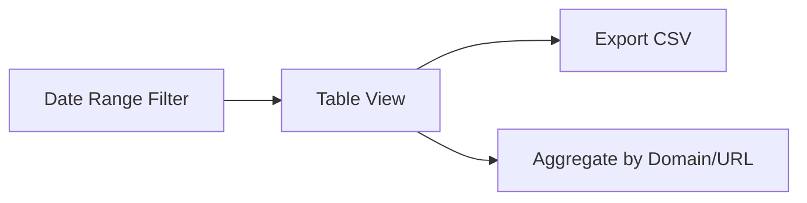

# Chrome Extension: Web Time Tracker - Product Requirements Document (PRD)

## **1. Overview**  
A Chrome extension designed to track the time spent on websites. It focuses on simplicity and long-term aggregation rather than date-based analysis.

- **Core Function:** Tracks the total time URLs are open and the active time spent viewing them since installation.
- **URL Tracking:** Normalizes URLs by removing query parameters and fragments, tracking time against the base path (protocol + domain + path).
- **Title Tracking:** Captures page titles and appends unique titles for the same normalized URL.
- **Active Time:** Time spent when a tab is the active tab within the currently focused browser window.
- **Total Time:** Total duration a tab with a specific normalized URL is open in any window (active or background).
- **Storage:** Uses IndexedDB for persistent local storage of time data.
- **Data Display:** Shows aggregated totals by domain, expandable to normalized URLs, on a dedicated stats page (`stats.html`).
- **Export:** Allows exporting aggregated data to a CSV file.
- **Simplicity:** No date-based filtering or complex inactivity detection (beyond tab/window focus).

---

## **2. Functional Requirements**  

### **2.1 Tracking Logic**  

#### **2.1.1 URL Normalization**
- Before tracking, all URLs are normalized:
    - Query parameters (`?key=value&...`) are removed.
    - URL fragments (`#section`) are removed.
- Example: `https://www.example.com/path/page?user=123#profile` becomes `https://www.example.com/path/page`.
- The normalized URL serves as the primary key for tracking time and titles.

#### **2.1.2 Time Recording**
- **Active Time (`activeSeconds`):**
    - Incremented every second (or similar small interval) ONLY for the normalized URL corresponding to the tab that is currently **active** within the currently **focused** browser window.
    - Requires checking `tab.active` and `window.focused` status via Chrome APIs (`chrome.tabs.onActivated`, `chrome.windows.onFocusChanged`, potentially periodic checks).
- **Total Time (`totalSeconds`):**
    - Incremented every **5 seconds** for the normalized URL of **any** open tab containing that URL, regardless of the tab's active state or the window's focus state.
    - Implemented via a background timer (`setInterval`) that queries all open tabs (`chrome.tabs.query({})`) and updates the corresponding records in IndexedDB.
- **Data Type:** Time will be stored as seconds (integer).

#### **2.1.3 Title Handling**
- When a tab's URL is first detected or changes (even if the *normalized* URL remains the same, e.g., navigating YouTube videos):
    - Wait ~2 seconds after the navigation/load event (`chrome.tabs.onUpdated` with `status === 'complete'`).
    - Fetch the tab's title (`tab.title`) via a content script or `chrome.scripting.executeScript`.
    - If the title is empty or unavailable, use the tab's full, non-normalized URL as the title.
    - Retrieve the existing stored title string for the *normalized* URL from IndexedDB.
    - If the newly fetched title is not already present in the stored string (using " | " as a delimiter), append it: `existingTitles + " | " + newTitle`.
    - Save the updated title string back to IndexedDB for the normalized URL.

#### **2.1.4 Ignored URLs & Contexts**
- URLs starting with `chrome://` or `chrome-extension://` will not be tracked.
- The New Tab Page will not be tracked.
- Tracking will be disabled in Incognito mode (extension will not request Incognito access).

#### **2.1.5 Event Handling**
- `chrome.tabs.onUpdated`: Detect URL changes (including within the same normalized path) and page loads to trigger time tracking updates and title fetching.
- `chrome.tabs.onActivated`: Detect active tab changes to update which URL receives active time increments.
- `chrome.windows.onFocusChanged`: Detect window focus changes to gate active time increments.
- `chrome.tabs.onRemoved`: Ensure time tracking stops cleanly for closed tabs (though the periodic update handles most cases).
- Background Timer (`setInterval`): Periodically update `totalSeconds` for all open tabs.

---

### **2.2 Data Storage**  

#### **IndexedDB Schema**  
```javascript
// Object Store: 'website_times'
{
  normalizedUrl: string, // Primary Key (e.g., "https://example.com/path")
  domain: string,        // Extracted domain (e.g., "example.com")
  titles: string,        // Appended titles, delimited by " | "
  activeSeconds: number, // Total active seconds since tracking began
  totalSeconds: number  // Total open seconds since tracking began
}
```

#### **Data Management**
- **Initialization:** On first load, create the IndexedDB database and object store.
- **Updates:** Time increments are added to existing records based on the `normalizedUrl`. If a URL is visited for the first time, a new record is created.
- **Data Clearing:** Provide an option on the stats page to:
    - Clear *all* tracking data.
    - (Optional Future Enhancement: Clear data based on specific domains/URLs).

#### **Error Handling**
- Log any IndexedDB errors (e.g., quota exceeded, write failures) to the browser's developer console.
- Store a flag or simple error message if a persistent DB error occurs. This flag will be checked by the stats page to display a notification.

---

### **2.3 Edge Cases & Considerations**
| Scenario                  | Handling                                                                                                |
|---------------------------|---------------------------------------------------------------------------------------------------------|
| Rapid tab switching       | Rely on `onActivated` and `onFocusChanged` events. Active time might have minor inaccuracies (±1s).        |
| Browser crash/restart     | Tracking resumes on restart. Time during the crash is lost. Totals are preserved in IndexedDB.            |
| Dynamic Title Changes     | Only the title captured ~2s after initial load/URL change is appended. Later dynamic changes ignored.     |
| Storage Errors            | Log to console, display notification on stats page. Tracking might pause for affected URLs if severe.     |
| Very Long Title Strings   | Titles are appended indefinitely in storage. Display will be truncated in the UI.                         |
| Extension Update/Restart  | Background script restarts; timers re-initialize. Tracking continues based on stored values.              |

---

## **3. Non-Functional Requirements**  
- **Performance**: Background processes (especially the 5-second `totalTime` update) should aim for minimal CPU impact (<1-2% average). Monitor impact, especially with many tabs open.
- **Development:** Use **TypeScript** for improved type safety and maintainability. Use a build tool (e.g., **Webpack**) to transpile TypeScript to JavaScript and bundle files for production.
- **Storage**: IndexedDB should handle tens of thousands of records efficiently. The primary limitation will be browser-imposed storage quotas.
- **Privacy**: All tracking data remains strictly local to the user's browser via IndexedDB. No external transmission.
- **Accuracy:** `totalTime` updates every 5 seconds, introducing a potential maximum inaccuracy of 5 seconds per interval per tab. `activeTime` updates more frequently (e.g., 1s) for better accuracy during focused use.

---

## **4. User Interface**  

### **4.1 Extension Icon Interaction**
- Clicking the extension icon in the Chrome toolbar opens the `stats.html` page in a new tab.

### **Stats Page (`stats.html`)**  

- **Layout:** Simple HTML page.
- **Error Notification:** A noticeable (but simple, e.g., a colored banner) message appears at the top if any persistent DB errors have been logged.
- **Data Display:**
    - A table showing aggregated time tracking data.
    - **Default View:** Rows aggregated by `domain`. Columns: `Domain`, `Active Time` (formatted DD:HH:MM:SS), `Total Time` (formatted DD:HH:MM:SS).
    - **Expansion:** Clicking on a domain row expands it to show individual `normalizedUrl` entries belonging to that domain.
    - **Expanded View Columns:** `Titles` (appended string, truncated visually after ~150 chars with ellipsis, full string shown on hover/tooltip, clickable to copy URL), `Active Time` (DD:HH:MM:SS), `Total Time` (DD:HH:MM:SS).
    - **Sorting:** Table columns should be sortable (Domain/URL, Active Time, Total Time).
- **Data Refresh:** Data is loaded when the page opens. No automatic real-time updates; user must manually refresh the page (F5) to see the latest totals.
- **Controls:**
    - **Export CSV Button:** Triggers the generation and download of the CSV file.
    - **Clear All Data Button:** Prompts the user for confirmation and then deletes all records from IndexedDB.

### **4.2 CSV Export**
- **Format:** Comma Separated Values (.csv file).
- **Content:** Exports the detailed, non-aggregated data.
- **Columns:**
    1. `Domain`
    2. `NormalizedURL`
    3. `Titles` (Full, non-truncated appended string)
    4. `ActiveSeconds` (Integer)
    5. `TotalSeconds` (Integer)

---

## **5. Implementation Checklist**  
1. [x] **`manifest.json`:**
    - Define basic extension properties (name, version, description, icons, manifest_version: 3).
    - Declare permissions: `tabs`, `storage`, `scripting`.
    - Register the background service worker (pointing to the compiled JS output, e.g., `dist/background.js`).
    - Define the action (toolbar icon click) to open `stats.html`.
2. [x] **Build Setup (e.g., Webpack):**
    - Configure Webpack (or chosen bundler) to handle TypeScript (`.ts`) files.
    - Set up transpilation (e.g., using `ts-loader` or `babel-loader` with TypeScript preset).
    - Configure output paths for compiled JavaScript files (e.g., to a `dist/` directory).
    - Handle copying static assets (`stats.html`, CSS, icons) to the output directory.
3.  [x] **`src/background.ts` (Service Worker):**
    - Implement IndexedDB setup/connection (`src/db.ts` helper).
    - Implement URL normalization function.
    - Add listeners: `chrome.tabs.onUpdated`, `chrome.tabs.onActivated`, `chrome.windows.onFocusChanged`, `chrome.tabs.onRemoved`.
    - Implement logic to track the currently active/focused tab's URL.
    - Implement timer (`setInterval`) for periodic checks (every 1s for active, every 5s for total).
    - Inside timer:
        - Query all tabs (`chrome.tabs.query`).
        - Increment `activeSeconds` for the active/focused URL.
        - Increment `totalSeconds` for all open, tracked URLs.
        - Handle DB updates (read, increment, write).
    - Implement logic to trigger title fetching via `chrome.scripting.executeScript` when needed.
    - Implement DB error logging.
4.  [x] **`src/db.ts` (Helper Module):**
    - Encapsulate IndexedDB logic: opening the DB, creating the object store (`website_times` with `normalizedUrl` as keyPath), reading records, writing/updating records, deleting records/clearing the store.
    - Handle DB versions and upgrades if schema changes later.
    - Use TypeScript types for DB operations and records.
5.  [x] **`src/stats.html` & `src/stats.css`:**
    - Basic HTML structure for the page (title, table container, buttons).
    - Link the compiled JS output (e.g., `dist/stats.js`).
    - Link the CSS file (`dist/stats.css`).
    - Create `src/stats.css` for all styling rules.
6.  [x] **`src/stats.ts` (for `stats.html`):**
    - On page load, connect to IndexedDB (`src/db.ts`).
    - Fetch all records from the `website_times` store.
    - Process data: aggregate by domain, format times (seconds to DD:HH:MM:SS).
    - Render the data table dynamically (handle expansion/collapse).
    - Implement client-side sorting for table columns.
    - Implement title truncation and hover/tooltip for full titles.
    - Implement CSV export functionality.
    - Implement "Clear All Data" button functionality (with confirmation dialog).
    - Check for and display DB error notification if needed.
7.  [x] **Utility Functions (`src/utils.ts`):**
    - Time formatting function (seconds to DD:HH:MM:SS).
    - URL normalization function (can be shared with background).
    - **Title Fetching Function (`getPageTitle`):**
        - Fetches page title for a given tab using `chrome.scripting.executeScript`.
        - Falls back to tab URL if title is unavailable.
        - Handles errors gracefully with console logging.
        - Used in background service worker for tracking page titles.

---

## **6. Appendix**  

### **6.1 Potential Future Enhancements**
- **Performance Optimization:** If the 5-second polling for `totalTime` proves too resource-intensive with many tabs, explore:
    - **Batching Updates:** Accumulate time increments in memory and write to IndexedDB less frequently (e.g., every 30-60 seconds or on specific events).
    - **Event-Based Total Time:** Track tab open/close times more directly using `onCreated`, `onUpdated`, `onRemoved` events and calculate durations, rather than polling. This requires more complex state management.
- **Data Clearing Granularity:** Add options to clear data for specific domains or URLs.
- **UI Filtering/Search:** Add basic search or filtering capabilities to the stats page table.
- **Date Ranges (Revisit):** If date-based analysis becomes necessary later, this would require a significant schema change (e.g., storing daily records instead of overall totals) and UI updates.

---