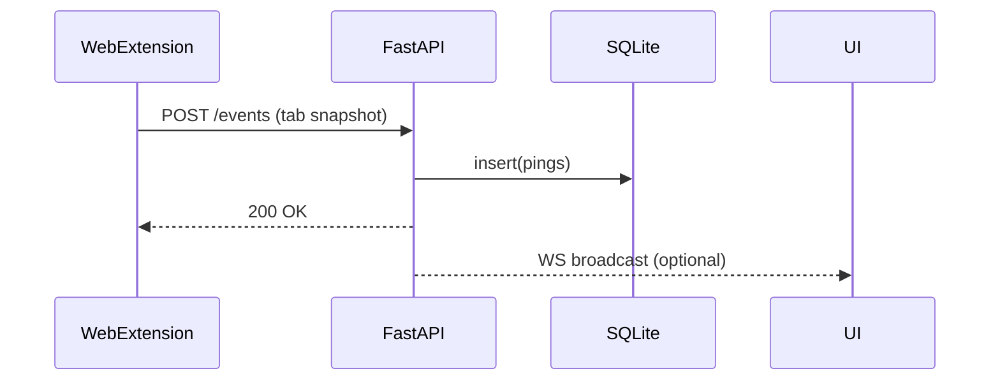
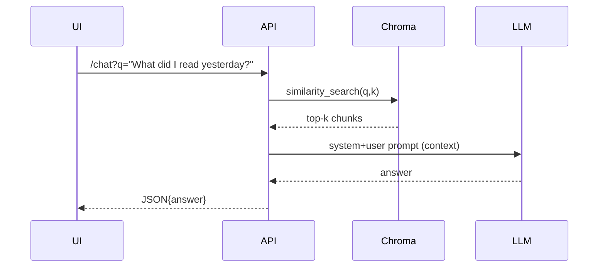

# Functional & Architectural Overview

## 1 · Product Vision & Philosophy

* **Local‑first privacy.** All data (raw text, screenshots, embeddings) stays on device unless the user opts‑in to sync.
* **Plugin‑oriented.** Every feature (watchers, voice, RAG chat, mini‑browser) ships as a detachable module so the core stays tiny.
* **Cross‑stack learning.** Rust commands are kept bite‑sized so web or Python devs can adopt them incrementally.

## 2 · High‑level Architecture

```mermaid
flowchart TD
    subgraph Desktop Shell (Tauri)
        TS[React/Tailwind UI] -- invoke --> RC((Rust Commands))
        RC -- spawn --> PY[Python Sidecar\nFastAPI + workers]
        RC -- tray --> A[Status‑bar pop‑over]
    end
    B[Browser Extension\n(MV3)] -->|POST /events| PY
    PY -- REST / WS --> TS
    PY -->|SQLite + Chroma| DB[(Local DB)]
```

### Component Roles

| Layer                  | Key Responsibility                                                      | Language               |
| ---------------------- | ----------------------------------------------------------------------- | ---------------------- |
| **Tauri shell**        | Window, tray icon, global hot‑keys                                      | Rust + WebView         |
| **Rust Commands**      | Native hooks: active window, clipboard, mic, spawn sidecars             | Rust                   |
| **Python sidecar**     | REST API (FastAPI), persistence (SQLite), embeddings (Chroma), RAG chat | Python                 |
| **Web UI**             | Dashboards, settings, chat                                              | TypeScript/React       |
| **Watchers / Plugins** | Data producers (browser tabs, AFK, screenshots, voice)                  | Any (Rust, Python, JS) |

## 3 · Core Data Model

| Field      | Example                      | Notes                        |
| ---------- | ---------------------------- | ---------------------------- |
| `id`       | `uuid4`                      | Primary key                  |
| `ts`       | `2025‑05‑18T12:34:56Z`       | RFC 3339 UTC                 |
| `source`   | `browser-tab`                | watcher name                 |
| `session`  | `syed‑mbp`                   | host ID                      |
| `payload`  | `{ "url":"…", "title":"…" }` | opaque JSON per watcher      |
| `duration` | `1.0`                        | seconds since previous event |

All plugins POST this schema to `/events`; transforms/aggregations happen in Python workers.

## 4 · Runtime Flows

### 4.1 Heartbeat Ingress



### 4.2 RAG Chat Query

